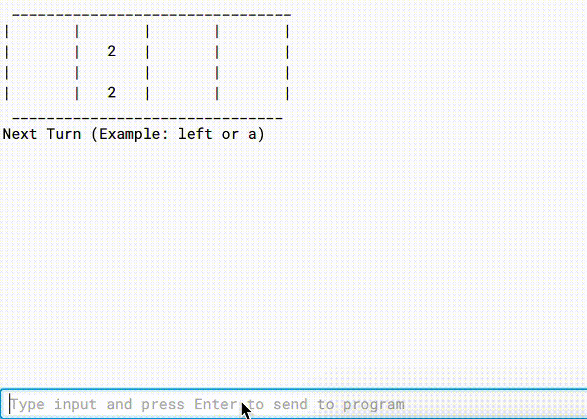

# 2048 

**2048** is a sliding puzzle game made in Java.

## User Stories

The following functionality is complete:
* [X] Program creates new board for every game
* [X] Program adds new blocks in random locations after every move
* [X] Program prints resulting board after every move
* [X] Program prints new board for user to move featuring new block
* [X] User can move board with keyboard commands (WASD) or words (left, up, etc.)
* [X] Program recognizes when game is over, either in victory or defeat

## License

    Copyright 2020 Jonathan Singer

    Licensed under the Apache License, Version 2.0 (the "License");
    you may not use this file except in compliance with the License.
    You may obtain a copy of the License at

        http://www.apache.org/licenses/LICENSE-2.0

    Unless required by applicable law or agreed to in writing, software
    distributed under the License is distributed on an "AS IS" BASIS,
    WITHOUT WARRANTIES OR CONDITIONS OF ANY KIND, either express or implied.
    See the License for the specific language governing permissions and
    limitations under the License.
